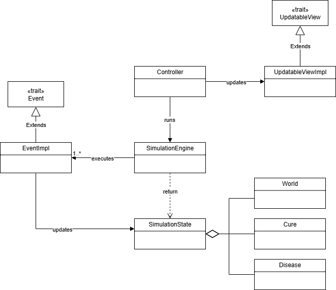
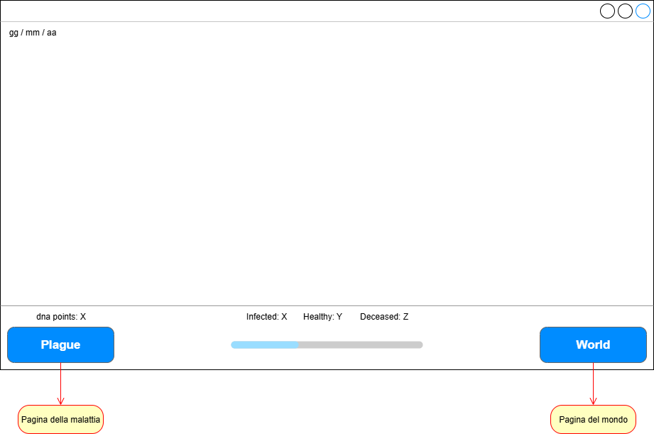
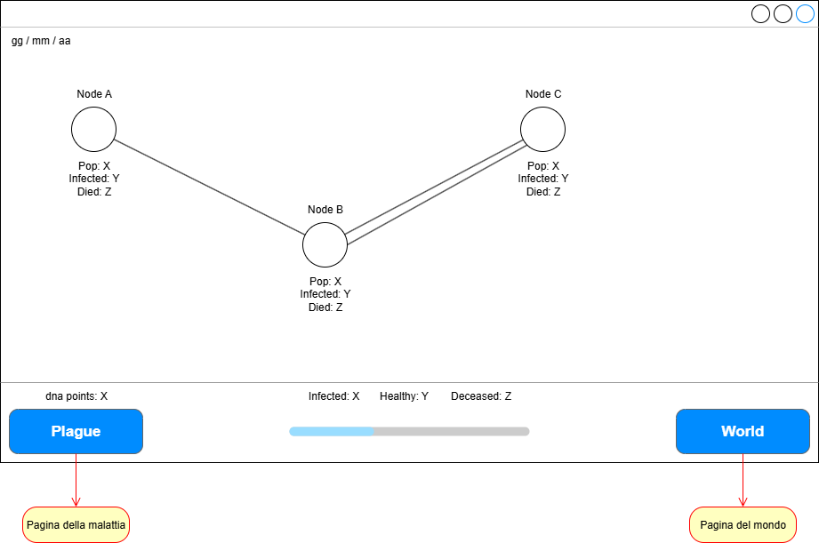
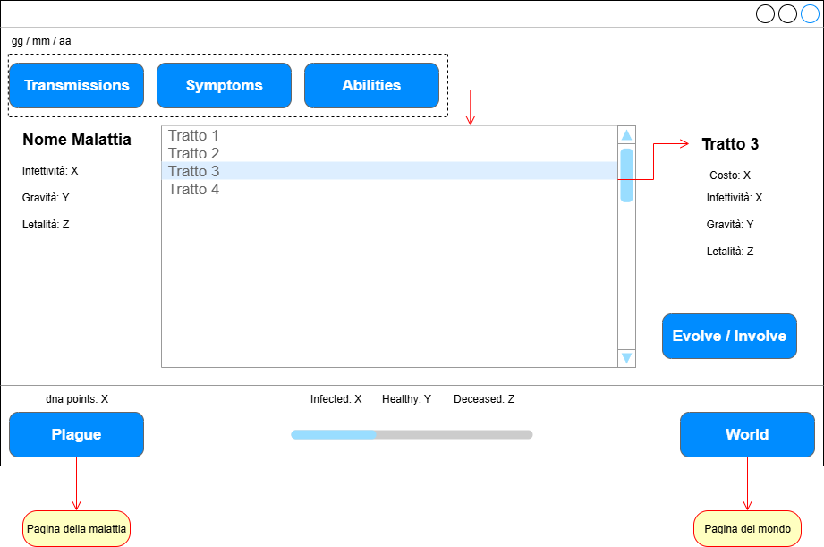

# Design architetturale
Architettura complessiva, 
descrizione di pattern architetturali usati, 
eventuali componenti del sistema distribuito,
scelte tecnologiche cruciali ai fini architetturali -- corredato da pochi ma efficaci diagrammi

L'architettura (diagramma + spiegazione in prosa) deve spiegare quali sono i sotto-componenti del sistema
(da 5 a 15, diciamo), ognuno cosa fa, chi interagisce con chi e scambiandosi quali dati -- i diagrammi aiutano,
ma poi la prosa deve chiaramente indicare questi aspetti.

## Entità principali

- `SimulationEngine`
  - Esegue una sequenza di `Event` che aggiornano il `SimulationState`

- `Event`
  - Definisce un evento specifico che modifica il `SimulationState`  

- `Controller`
  - Esegue ciclicamente la sequenza di eventi definita dal `SimulationEngine` e inoltra il nuovo
  `SimulationState` all'`UpdatableView`

- `UpdatableView`
  - Definisce le componenti di `view` che necessitano di essere aggiornate in base
  allo stato corrente della simulazione  
  - /////////////`MainView`: Implementazione principale di `UpdateableView` passata al `Controller`
  tramite `dsl` che, aggiornata a ogni ciclo, aggiorna anche le sue sottocomponenti che
  estendono `UpdatableView` /////////// *design di dettaglio*

- `SimulationState`
  - Contiene gli elementi del dominio che possono essere modificati tramite `Event` come la malattia,
  il mondo e la cura

## Applicazione
### Interfaccia Introduttiva
L'interfaccia introduttiva fornisce una breve spiegazione del gioco.
Consente al giocatore di selezionare il nodo di inizio della malattia e di avviare
la simulazione tramite un pulsante *Start*

### Interfaccia Principale
L'interfaccia principale mostra la partita in corso e nello specifico:
- La data corrente
- I punti dna in possesso del giocatore
- Il numero totale di persone sane, infette e decedute nel mondo
- Il progresso della cura

È dotata di due pulsanti:
- *World*: per mostrare la pagina del mondo 
- *Plague*: per mostrare la pagina della malattia

#### Pagina del Mondo
La pagina del mondo mostra tutti i nodi con le relative popolazioni, numero di infetti,
morti e collegamenti

#### Pagina della Malattia
La pagina della malattia mostra il nome e le statistiche complessive della malattia.
Sono presenti in oltre tre pulsanti:
- *Transmissions*: Mostra la pagina dedicata all'evoluzione delle trasmissioni
- *Symptoms*: Mostra la pagina dedicata all'evoluzione dei sintomi
- *Abilities*: Mostra la pagina dedicata all'evoluzione delle abilità

Selezionando un tratto viene mostrata una piccola interfaccia che mostra le sue statistiche
e un pulsante *Evolve*, se la malattia non lo possiede ancora, che
consente di evolverlo; altrimenti viene mostrato un pulsante *Involve*,
che consente di rimuovere il tratto selezionato da quelli che la malattia possiede.

[Back to index](../index.md) |
[Previous Chapter](../2-requirement-specification/req.md) |
[Next Chapter](../4-detailed-design/design.md)