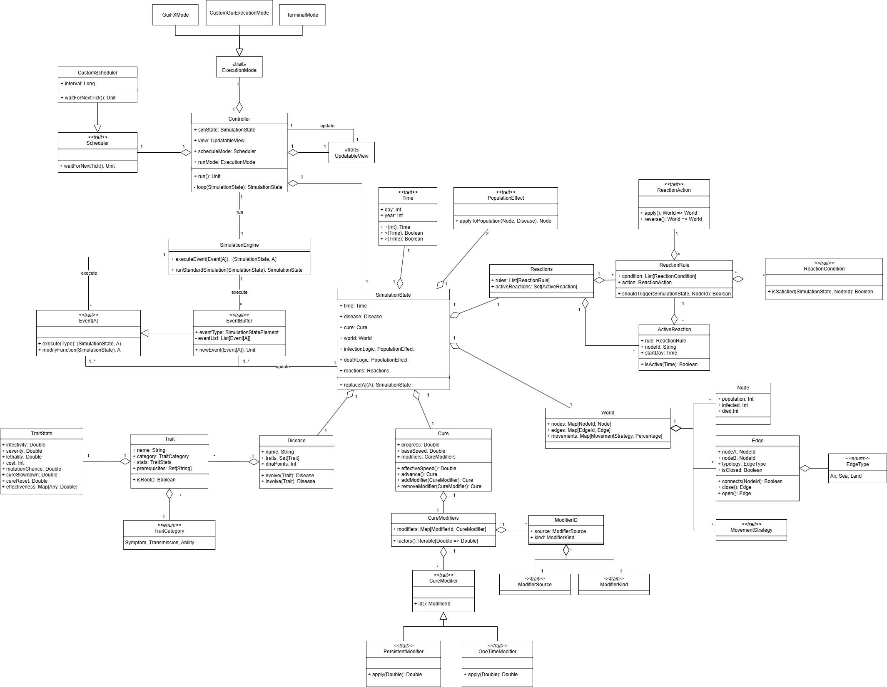

# Design di dettaglio

Il sistema è suddiviso in quattro moduli principali:
- **Controller**
- **Engine**
- **Model**
- **View**

## Tecnologie utilizzate
Le tecnologie utilizzate, oltre a quelle obbligatorie, sono:
- **ScalaFX**: framework d’interfaccia grafica per sviluppare schermate in maniera facile.
- **TuProlog**: framework per la programmazione logica, al fine d’implementare alcune regole tramite Prolog e utilizzarle all’interno dell’applicativo.
- **ScalaTest**: tool per lo sviluppo di test in Scala.
- **Cats**: libreria per la programmazione funzionale in Scala.
- **Apache commons math**: libreria usata per la generazione di numeri casuali e per il calcolo di distribuzioni statistiche.

## Core del progetto
Il sistema é sviluppato come un sistema di simulazione a eventi dove ogni evento rappresenta un cambiamento dello stato della simulazione.
É strutturato in diverse parti:
- Engine
- Malattia
- Mondo
- Cura
- Reazioni

### Engine
SimulationEngine rappresenta la parte centrale del sistema: ha il puro compito di eseguire uno step della
simulazione e internamente mantiene lo stato della simulazione in modo **immutabile**, aggiornandolo ogni volta che viene eseguito uno step.
Esegue in cascata tutti gli eventi, uno dopo l'altro, e alla fine ritorna il nuovo stato della simulazione.
Non contiene logiche specifiche ma si limita a invocare gli eventi, rispettando un flusso di simulazione prestabilito.
Questa impostazione riflette un'architettura event-driven, dove ogni evento è un’unità indipendente che incapsula una modifica ben definita sul sistema.
Inoltre, questo approccio assicura un’alta coesione interna e una bassa dipendenza da altre parti del progetto,
facilitando manutenzione, testing e riutilizzo.

### Mondo
Il sottosistema **Mondo** rappresenta la rete globale su cui si muove la popolazione e si diffonde la malattia.
È composto da tre elementi principali:
1. **Nodi**: rappresentano le entità geografiche (città, regioni) con una popolazione, una quantità di infetti e morti.
2. **Collegamenti**: Connessioni tra i nodi che definiscono la struttura del grafo. Ogni edge è non orientato e ha una **tipologia**.
3. **Strategie di Movimento**: Definiscono come le persone si muovono tra i nodi, influenzando la diffusione della malattia.

Quando si applica una strategia di movimento, viene determinato non solo quante persone si spostano,
ma anche quanti tra questi sono infetti, così da mantenere una propagazione realistica dell’infezione durante i trasferimenti.

### Cura
Il sottosistema di ricerca della cura modella gli sforzi scientifici globali per sviluppare un rimedion alla malattia. 
È composto da due elementi chiave:
1. **Stato della ricerca**: Tiene traccia del progresso (0-100%) e della velocità base di avanzamento della cura
2. **Modificatori della ricerca**: Rappresentano le azioni che possono influenzare la velocità e il progresso della ricerca

Il sistema di cura interagisce con:
- **Il Mondo**: ogni nodo del mondo può contribuire alla ricerca della cura, aumentando la velocità di avanzamento.
- **La Malattia**: alcuni tratti della malattia possono influenzare la ricerca della cura, ad esempio rendendola più difficile.

### Reazioni
Il sottosistema delle reazioni modella le risposte del mondo di gioco alla malattia e/o alla cura. 
Si basa su un meccanismo di regole condizionali associate ad azioni specifiche:
1. **Regole di Attivazione**: Definiscono le condizioni che devono essere soddisfatte per attivare una reazione.
2. **Azioni**: Le azioni che vengono eseguite quando le condizioni sono
3. **Durata**: La durata per cui la reazione rimane attiva. Può essere temporanea o permanente.

Le reazioni possono essere di vario tipo e comportano una modifica allo stato del mondo, come ad esempio la chiusura di 
collegamenti tra nodi, impedendo la diffusione della malattia.

## Avvio della Simulazione
La simulazione viene inizializzata e avviata tramite dsl con il comando `setup` fornendo i seguenti elementi:

- `SimulationState`
  - `Disease`
  - `Cure`
  - `World`
  - `InfectionLogic`
  - `DeathLogic`
  - `Reactions`
  - `Time`
- `Condizioni di fine simulazione`
- `Scheduler`
- `UpdatableView`
- `ExecutionMode`

Quando viene avviata l'applicazione, viene chiesto al giocatore di selezionare il `Node`
da dove vuole fare iniziare la sua `Disease`.
Dopo la selezione, questa informazione viene passata al `SimulationState` tramite dsl.

## Simulation loop
Il `Controller` esegue ricorsivamente la catena di `Event` dichiarati all'interno del `SimulationEngine` su un thread separato
finché la simulazione non termina raggiungendo le condizioni di fine simulazione. Durante il loop, una volta che 
tutti gli eventi sono stati eseguiti, il `Controller` si occupa anche di richiamare l'aggiornamento della `UpdatableView`
passando il nuovo stato della simulazione, ottenuto dopo l'esecuzione della catena di eventi.

## Collegamento Model-View
Il collegamento tra il Model e la View avviene durante il setup della simulazione: la DSL contiene la keyword `binding`
alla quale bisogna passare un oggetto che implementa l'interfaccia `UpdatableView` e che contenga tutte le parti di view che si vogliono aggiornare.
Questo design si ispira al pattern Observer: la *subscribe* é mascherata dalla keyword `binding` e il *notify* 
é lasciato alla responsabilità del `Controller` che, una volta ottenuto il nuovo stato della simulazione,
lo passa all'oggetto che implementa l'interfaccia `UpdatableView` chiamandone l'aggiornamento.
Il `Controller` fa quindi come da collante tra il Model e la View, permettendo di mantenere separati i due moduli.

[Back to index](../index.md) |
[Previous Chapter](../3-architectural-design/design.md) |
[Next Chapter](../5-implementation/impl.md)