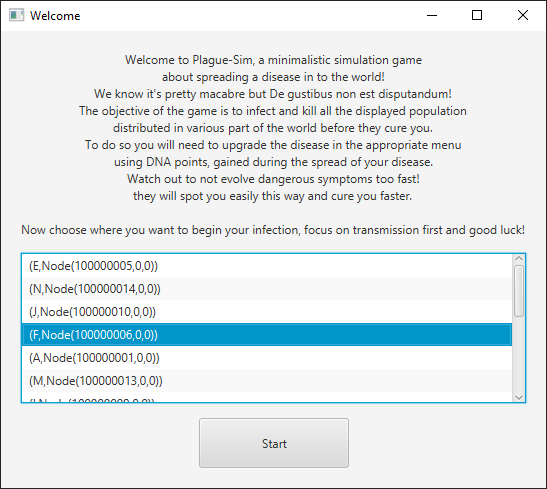

# Implementazione

## Interfaccia Grafica

### IntroPopUp
`IntroPopUp` implementa l'interfaccia introduttiva dove si può selezionare il `Node`
al quale assegnare il primo infetto da `Disease`.

Il bottone si attiva se viene selezionato un elemento della lista e una volta premuto chiude
`IntroPopup` e mostra `MainView`.

### MainView
`MainView` implementa la visualizzazione della data e dell'interfaccia inferiore dove
sono presenti i pulsanti
- `Plague`: che porta alla pagina della malattia, implementata in `PlagueView`
- `World`: che porta alla pagina del mondo, implementata da `WorldView`, e già in mostra in seguito
al click su `Start` di `IntroPopUp`

Oltre che la barra informativa sullo stato della ricerca della cura, il resoconto della popolazione
infetta, sana e deceduta, e il numero di `dnaPoints` posseduti da `Disease` e spendibili dal
giocatore nella pagina della malattia.

#### WorldView
Durante l'infezione `WorldView` mostra gli `Edge` ancora aperti con i colori
- verde per `Land`
- blu per `Water`
- rosso per `Air`

E colora i `Node` con un gradiente di rosso relativo al rapporto infetti su popolazione totale.

Con l'aggravarsi di `Disease` gli `Edge` chiudono e perdono il colore e i `Node` si colorano
di un gradiente di nero determinato dal rapporto di morti su popolazione.

#### PlagueView
`PlagueView` mostra sulla sinistra le informazioni principali di `Disease` e nella parte
superiore i tre bottoni che alla pressione mostrano una `TraitList` contenete:
- `Transmissions`: I `Trait` di tipo `Transmission`
- `Symptoms`: I `Trait` di tipo `Symptom`
- `Abilities`: I `Trait` di tipo `Transmission`

Le liste rendono interagibili solo i `Trait` i cui `prerequisites` sono già acquistati, quindi a
inizio partita sono selezionabili solo i `Trait` senza `prerequisites`.
Quando il giocatore seleziona un `Trait` della lista, viene mostrato sulla destra `TraitInfoPanel`,
contenente le informazioni relative a quel trait, e un bottone `Evolve`.

Premuto `Evolve`, il `Trait` selezionato è acquistato se il giocatore ha accumulato
`dnaPoints` superiori a `cost` di `Trait`.
L'acquisto cambia lo sfondo del `Trait` sulla `TraitList`, le statistiche di `Disease` sono
aggiornate, eventuali `Trait` più avanzati sono sbloccati (Air 2 in questo caso) e il pulsante
`Evolve` è sostituito da `Involve`, la cui pressione rimuove il `Trait` selezionato e riporta allo
stato precedente.

## Implementazioni Personali

## [Andrea Zavatta](zavatta/zavatta.md)

## [Lorenzo Tosi](tosi/tosi.md)

## [Matteo Susca](susca/susca.md)

## [Alessandro Stefani](stefani/stefani.md)

[Back to index](../index.md) |
[Previous Chapter](../4-detailed-design/design.md) |
[Next Chapter](../6-testing/testing.md)